# Screenshots

Captured on an iPhone 17 Pro Max simulator (iOS 26.5) with demo cards for made-up stores. Each screen is shown in light and dark mode.

| Screen                                                                  | Light                                                                          | Dark                                                                         |
| ----------------------------------------------------------------------- | ------------------------------------------------------------------------------ | ---------------------------------------------------------------------------- |
| **Cards** Pinned cards above the others, sorted A → Z                | 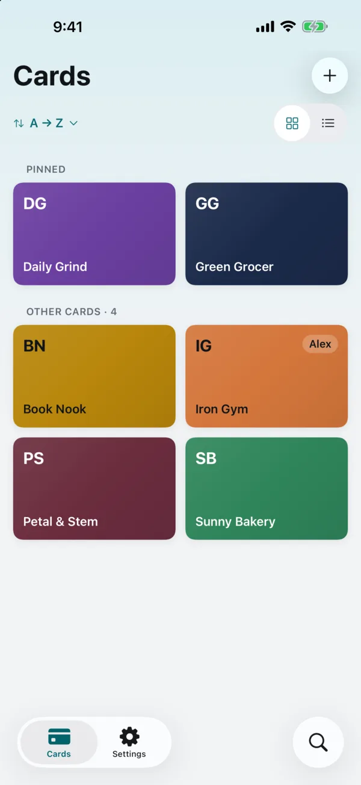          | 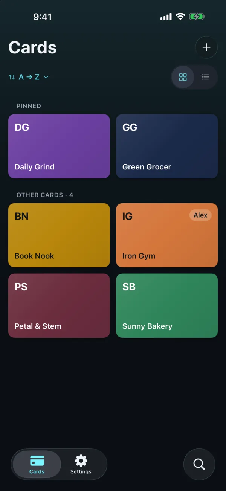          |
| **List layout** Same cards as a list, with owner and barcode type    | 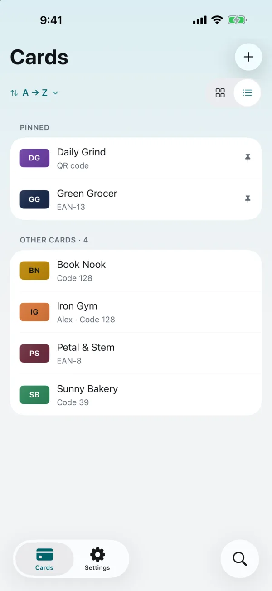     | 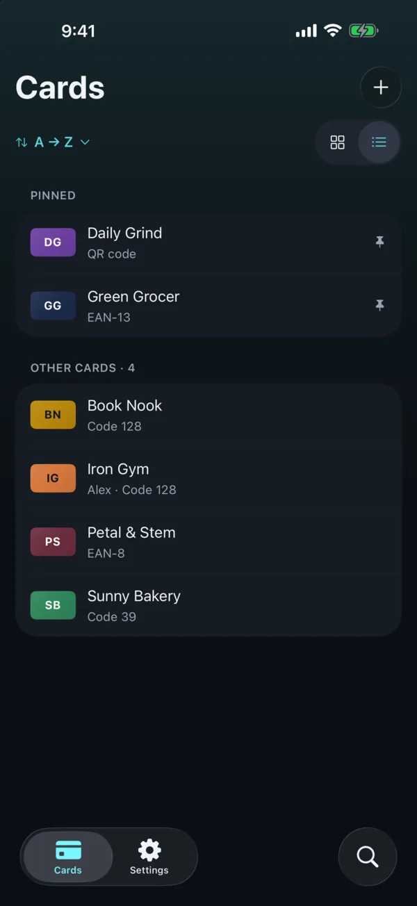     |
| **Sort** Most used, recently used, A → Z or your own order           | 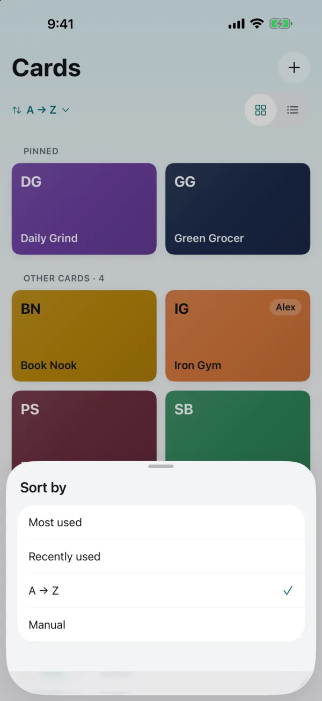           | 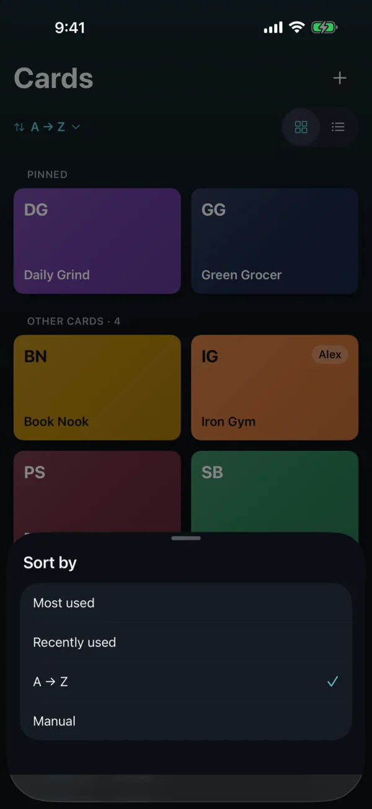           |
| **At the till** EAN-13 sized to the GS1 specs, brightness at maximum | 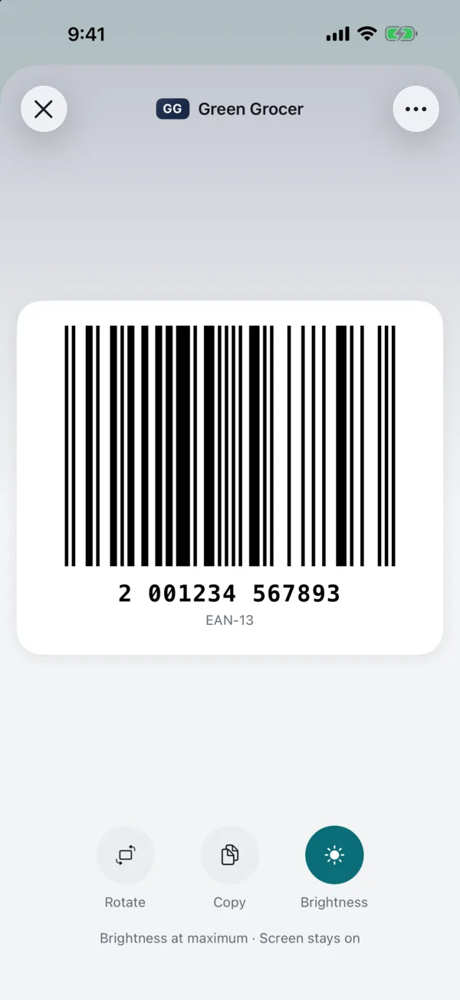 | 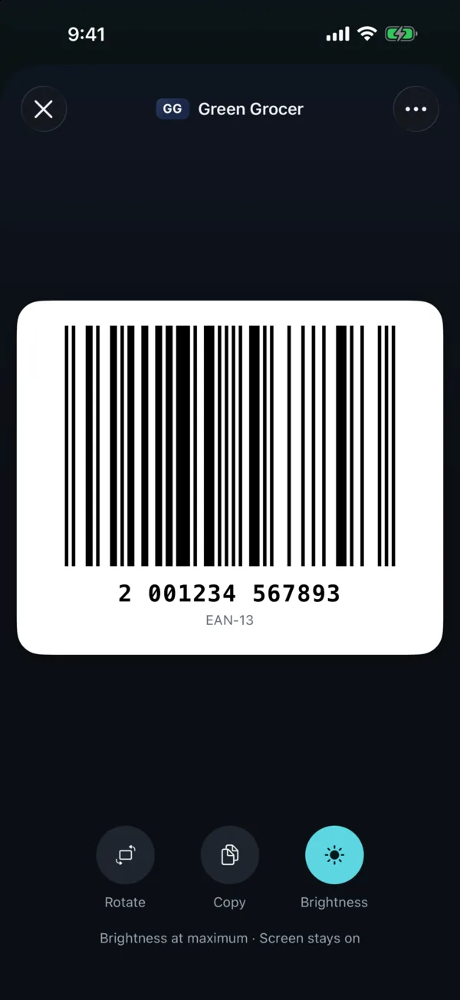 |
| **Rotated code** A Code 128 across the whole screen                  | 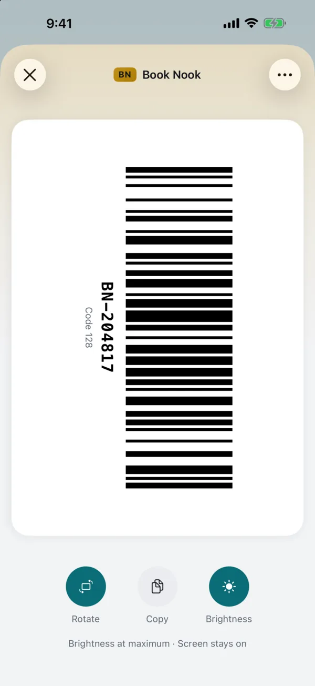   | 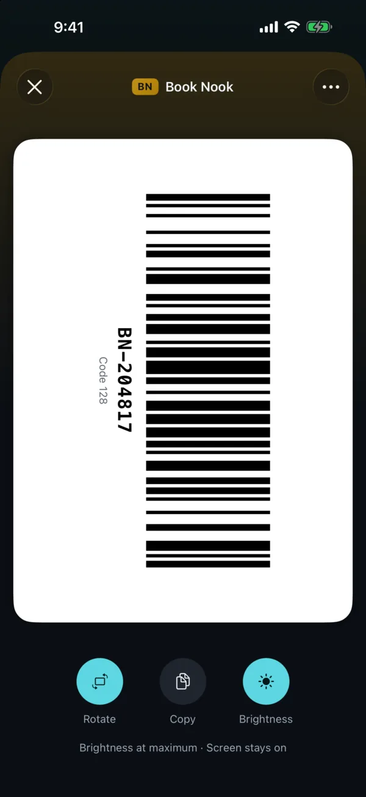   |
| **Card editor** Live preview, barcode type, color, owner and note    | 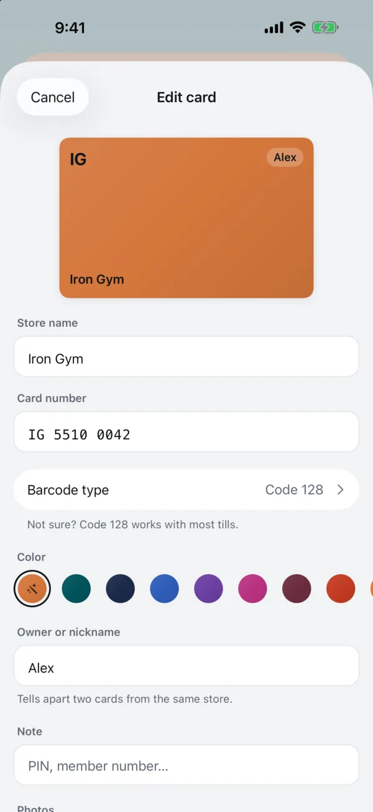     | 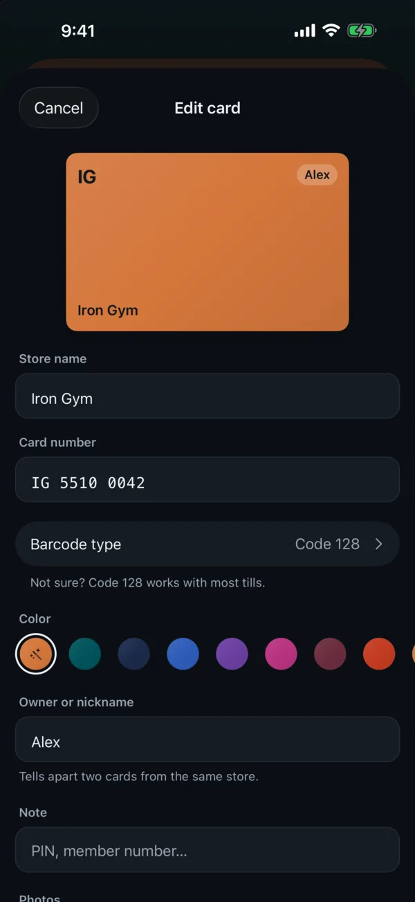     |
| **Search** Recently used cards, search by store, owner or number     | 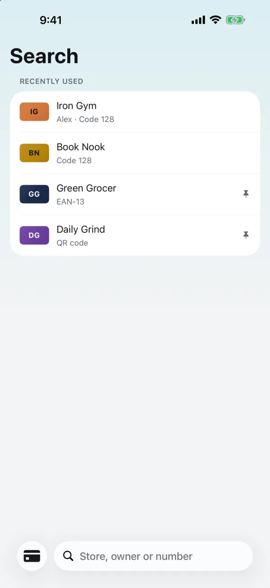             | 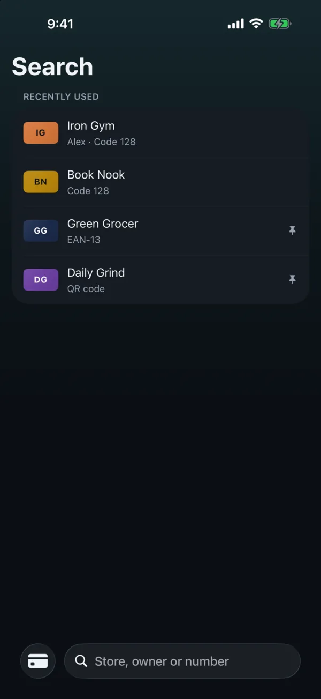             |
| **Settings** Theme, accent color, language, brightness and backups   | 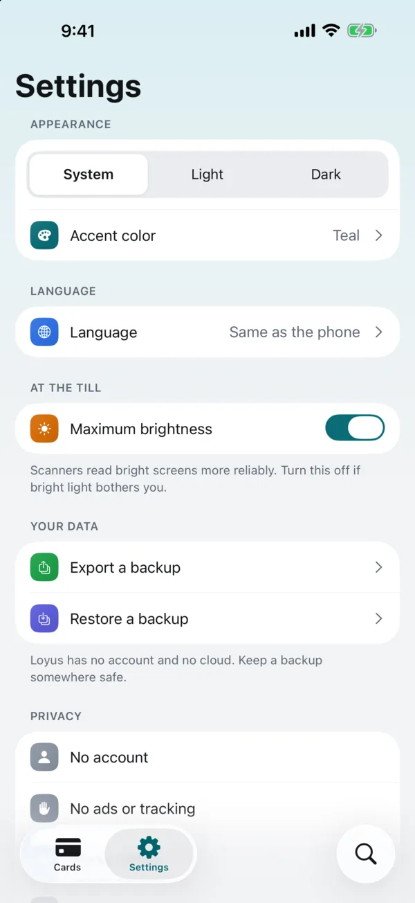         | 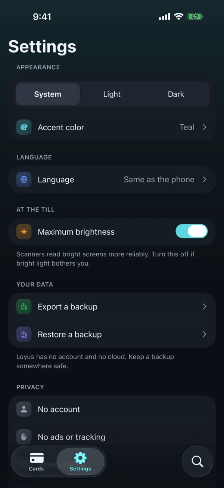         |
| **Accent color** Six accents for buttons and switches                | 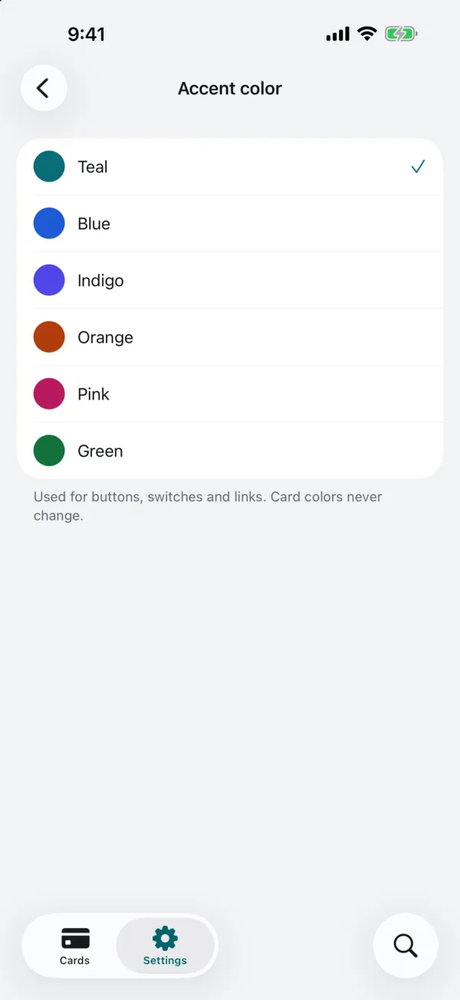       | 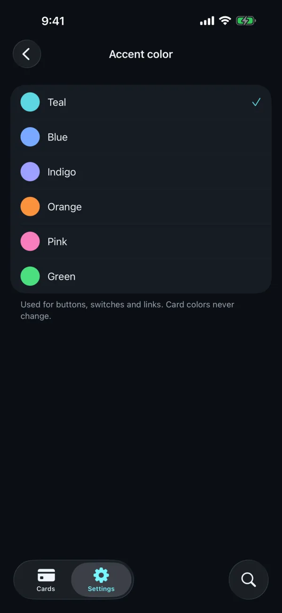       |
| **Welcome** First launch: scan, type or restore a backup             | 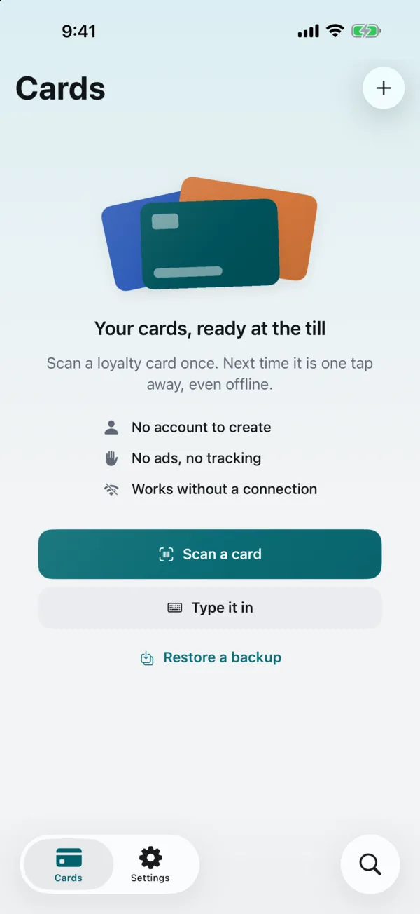    | 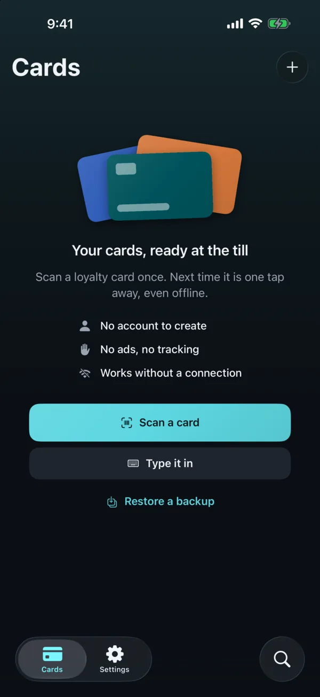    |
